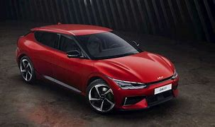

# Electric Vehicle Efficiency Evaluation

## Executive Summary

The UK is undergoing a transformative shift from internal combustion engine (ICE) vehicles to electric vehicles (EVs) as part of its commitment to achieving net-zero carbon emissions by 2050 ([HM Government, 2021](https://assets.publishing.service.gov.uk/media/6194dfa4d3bf7f0555071b1b/net-zero-strategy-beis.pdf)). This transition is driven by government policies, market dynamics, infrastructure development, and the need to reduce environmental impact.

Manufacturers have embraced this strategy with many of them planning to electrify their lineups before 2035. However, the cost of EVs is higher than that of their ICE counterparts, and their current capacity also leaves owners with "Range Anxiety."

This led me to the question: **Which EV offers the best value for money for the average worker?** Initial research revealed that there are few comprehensive studies on EVs, and those available are often conducted by manufacturers or automotive media, raising concerns about objectivity. To address this, I conducted an independent analysis using public data from Kaggle and statistics from the UK Department for Transport to identify the best EV for daily commuting.

### Methodology

1. **Data Collection and Preparation:**
    - Data was sourced from the [Electric Vehicle Dataset 2024 on Kaggle](https://www.kaggle.com/datasets/vanillatyy1/electric-vehicle-dataset) and the [UK Department for Transport](https://www.gov.uk/government/statistics/transport-statistics-great-britain-2022/transport-statistics-great-britain-2022-domestic-travel).
    - The dataset was ingested into Python using the Pandas library:

    ```python
    import pandas as pd

    # Load the dataset
    file_path = 'C:\\Users\\HUCC\\Downloads\\cars_data_RAW (1).csv'
    df = pd.read_csv(file_path)
    ```

    - Columns were renamed for better readability:

    ```python
    # Rename columns for better readability
    df.columns = [
        'Row_ID', 'Title', 'Model', 'Battery', 'Price_Range', '0-100_Acceleration',
        'Top_Speed', 'Range', 'Efficiency', 'Fastcharge', 'Germany_Price', 
        'Netherlands_Price', 'UK_Price', 'Drive_Configuration', 'Tow_Hitch', 
        'Towing_Capacity', 'Number_of_Seats'
    ]
    ```

    - The 'Range' column was cleaned to ensure numeric values and converted from kilometers to miles:

    ```python
    # Clean the 'Range' column to ensure numeric values and convert from KM to MI
    df['Range'] = df['Range'].str.extract('(\d+)').astype(float) * 0.621371
    ```

    - Data was then grouped by manufacturer to calculate metrics such as the number of models, average battery capacity, and average cost:

    ```python
    # Number of different models by each manufacturer
    model_count = df.groupby('Title')['Model'].nunique()

    # Average battery capacity for each manufacturer
    avg_battery_capacity = df.groupby('Title')['Battery'].mean()

    # Function to transform and remove currency symbols to allow for aggregate functions to be applied later
    def clean_currency(value):
        if isinstance(value, str):
            value = value.replace('€', '').replace('£', '').replace(',', '').replace('*', '').strip()
            try:
                return float(value)
            except ValueError:
                return pd.NA
        elif isinstance(value,(int, float)):
            return value
        else:
            pd.NA

    # Average cost for each manufacturer
    df['UK_Price'] = df['UK_Price'].apply(clean_currency)

    avg_cost = df.groupby('Title')['UK_Price'].mean()

    # Average mileage (Range) for each manufacturer
    avg_mileage = df.groupby('Title')['Range'].mean()

    # Average miles per kWh (Efficiency) for each manufacturer
    mi_kwh = avg_mileage/avg_battery_capacity

    # Efficiency vs Cost
    ef_v_cost = avg_cost/mi_kwh
    ```

    - Finally, all results were combined into a single DataFrame for better readability and exported for further visualization:

    ```python
    # Combine all results into a single DataFrame for better readability
    results = pd.DataFrame({
        'Model Count': model_count,
        'Average Battery Capacity': avg_battery_capacity,
        'Average Cost': avg_cost,
        'Average Mileage': avg_mileage,
        'Average Mi/kWh': mi_kwh,
        'Efficiency vs Cost': ef_v_cost
    }).reset_index()

    results = results.dropna(subset=['Average Cost'])

    # Export the file for better and more efficient visualizations in PBIX
    file_path = "C:\\Users\\HUCC\\OneDrive - Direct Line Group\\Apprenticeship Work\\Term 3\\Data Science, M5, Data Professional Practice\\Public Data\\"
    filname = "Electric Car Analysis.xlsx"

    results.to_excel(file_path + filname, index=False)
    ```

2. **Data Analysis:**
    - The cleaned data was analyzed using Power BI to visualize trends, identify outliers, and conduct linear regression analysis.
    - A dimension table for manufacturers was created to streamline the analysis and avoid data duplication. 
    - Vehicles were grouped by manufacturer to assess their efficiency and suitability for the average UK commuter.
    - Key metrics included vehicle range, price, and efficiency (measured in miles per kilowatt-hour, Mi/KWh).
      
      This shows metrics of each manufacturer, such as number of models, range and price.
      
      
      Average EV Price Vs Average UK Salary

      
      Showing how the cost of the EV is directly correlated with it range. With the main cost of the EV being related to its Battery, an increase in capactiy will drive a cost increase but also a range increase at the same time.

      
      
      These show how the EV efficency is inversely correlated to its cost. Larger vehicles equate to more weight and so more energy requirement from the battery
      The removal of outliers from the 2nd chart enhances the linear regression r-squared value that was lowered due to the "luxery" brands.

      
      This final image shows how many commutes each car can complete before it woud have to be recharged. This assumes an Average UK commute distance of 19.5 Mi and that the battery would be 0%

### Results

The analysis revealed that while every EV has a place in the market, some are better suited for the average UK commuter than others:

- **High Charging Frequency:** Manufacturers like Dacia, Mazda, and Fiat produce affordable models but would require almost daily recharging, which is inefficient and inconvenient for most commuters.
- **Luxury Options:** On the other end, brands like Lotus, Porsche, and Rolls Royce offer impressive range but at prices far exceeding the average UK salary (~£34K).
- **Best Value:** By focusing on EVs that only need to charge once per workweek (5 commuter trips) and are priced under £60K, 17 manufacturers were identified. Among these:
  - **MG** offered the lowest cost.
  - **BYD** provided better range and efficiency, albeit at a £5K higher price.
  - **Fisker** emerged as the top choice, with the best range under £50K, requiring only one weekly recharge based on the average daily commute.

### Conclusion

While the data-driven analysis identified several strong contenders, personal preference ultimately influenced my final decision. Despite the data pointing to other options, I chose the **Kia EV6** due to its appealing design and sufficient range (over 250 miles), allowing for 6.0 commuter trips before requiring a recharge.



**Happy Driving**

## Project Background

The UK's rapid transition to electric vehicles is reshaping the automotive landscape, with manufacturers racing to electrify their fleets by 2035. However, the higher costs of EVs and concerns about "Range Anxiety" still present challenges for consumers. This project aimed to determine which EV offers the best value for money for the average UK worker, using objective data analysis rather than relying on manufacturer claims or media reviews.

## Data Infrastructure & Tools

- **Python & Pandas:** Utilized for data cleaning and manipulation, particularly in converting data from US to UK standards.
- **Power BI:** Employed for visualizations and deeper analysis of trends and outliers.
- **Data Sources:** 
  - Raw data from Kaggle, including current EV manufacturers, vehicles, capacity, range, and pricing.
  - UK commuter statistics from the Department for Transport.


